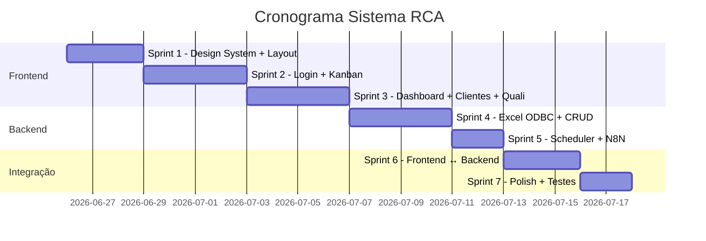

# Plano de Implementação — Sistema RCA (Reativação Comercial Automatizada)

## Diagnóstico: Estado Atual do Projeto

O projeto já possui uma **estrutura de scaffolding bem montada**, mas a maioria dos componentes está no estágio de esqueleto/placeholder. Aqui está o mapa do que existe e o que falta:

### ✅ O que já existe (esqueleto funcional)

| Camada | Arquivos | Status |
|--------|----------|--------|
| **Infraestrutura** | `package.json`, `vite.config.js`, `tailwind.config.js`, `requirements.txt`, `pyproject.toml`, `Dockerfile` | Configurados |
| **Frontend - Rotas** | [App.jsx](file:///c:/Users/supervisor.ti/Desktop/Futuras%20Aplicações/RCA-Torp/apps/web/src/App.jsx) com 7 rotas definidas | Funcional |
| **Frontend - Auth** | [AuthContext.jsx](file:///c:/Users/supervisor.ti/Desktop/Futuras%20Aplicações/RCA-Torp/apps/web/src/contexts/AuthContext.jsx) com Supabase Auth | Funcional |
| **Frontend - API Client** | [api.js](file:///c:/Users/supervisor.ti/Desktop/Futuras%20Aplicações/RCA-Torp/apps/web/src/lib/api.js) com wrapper fetch + auth headers | Funcional |
| **Backend - App** | [main.py](file:///c:/Users/supervisor.ti/Desktop/Futuras%20Aplicações/RCA-Torp/apps/api/src/rca_api/main.py) com CORS, Sentry, rate-limit, lifespan | Funcional |
| **Backend - Auth** | [dependencies.py](file:///c:/Users/supervisor.ti/Desktop/Futuras%20Aplicações/RCA-Torp/apps/api/src/rca_api/dependencies.py) com JWT + RBAC | Funcional |
| **Backend - Routers** | 8 routers registrados (clientes, pipeline, contatos, qualificação, sync, dashboard, usuários, health) | Esqueleto |
| **Backend - Services** | 7 services (cliente, pipeline, contato, dashboard, prioridade, qualificação, sisplan_sync) | Esqueleto |
| **Backend - Schemas** | Pydantic DTOs para auth, cliente, contato, dashboard, pipeline, qualificação | Esqueleto |
| **DB** | 2 migrations SQL (schema base + RLS policies) | Pronto |

### ❌ O que está faltando / incompleto

| Item | Detalhe |
|------|---------|
| **Frontend - UI real** | Componentes existem mas são **esqueletos mínimos** sem design visual, sem estilos premium, sem animações |
| **Frontend - Layout** | Sidebar sem navegação completa, Header sem avatar/perfil |
| **Frontend - Kanban** | KanbanBoard/Card/Column são stubs básicos sem drag-and-drop funcional implementado |
| **Frontend - Dashboard** | StatsCards, FunnelChart, Timeline são placeholders sem visualização real |
| **Frontend - Páginas** | ClientesPage, ClienteDetailPage, ConfigPage são shells sem UI completa |
| **Frontend - Responsividade** | Nenhuma implementação responsiva |
| **Frontend - Design System** | `globals.css` tem apenas 3 linhas, Tailwind config tem apenas 2 cores customizadas |
| **Backend - Repositories** | Pasta existe mas sem implementação verificada |
| **Backend - Integrations** | SISPLAN ODBC e N8N webhooks sem implementação real |
| **Dados de teste** | Sem mock data para desenvolvimento isolado |
| **ODBC → Excel** | Não adaptado — o SDD assume SQL Server mas a fonte real será uma planilha Excel |
| **npm install** | Dependências não instaladas |

---

## Decisão de Arquitetura: Frontend-First

> [!IMPORTANT]
> **Recomendação: começar pelo Frontend** e concordo com a sua sugestão. Motivos:
> 1. **Feedback visual imediato** — você verá o sistema tomando forma desde o dia 1
> 2. **Dados mockados** — usaremos dados fictícios realistas embutidos no frontend enquanto o backend não está pronto
> 3. **Design validado antes de integrar** — evita retrabalho quando conectar ao backend
> 4. **Motivação** — um kanban bonito e funcional é mais motivador que endpoints JSON

A estratégia será:
1. **Sprint 1-3**: Frontend completo com dados mock (já funciona visualmente)
2. **Sprint 4-5**: Backend com leitura de planilha Excel via ODBC
3. **Sprint 6**: Integração Frontend ↔ Backend (trocar mocks por API real)
4. **Sprint 7**: Automações N8N e polimento final

---

## Adaptação ODBC → Planilha Excel

> [!IMPORTANT]
> O SDD original assume conexão ODBC com SQL Server (SISPLAN). Como a fonte de dados real será uma **planilha Excel**, adaptaremos usando:
> - **Driver ODBC para Excel**: `{Microsoft Excel Driver (*.xls, *.xlsx, *.xlsm, *.xlsb)}` ou `openpyxl` como fallback
> - **Formato esperado da planilha**: colunas mapeadas para os campos do SDD (`CODIGO`, `RAZAO_SOCIAL`, `CNPJ`, etc.)
> - **Caminho da planilha**: configurável via variável de ambiente `EXCEL_FILE_PATH`
> - A lógica de sync permanece idêntica — só muda a camada de conexão

### Preciso de esclarecimento:

> [!WARNING]
> **Sobre a planilha Excel:**
> 1. Você já tem uma planilha de exemplo com os dados dos clientes? Se sim, pode compartilhar as **colunas/cabeçalhos** para eu mapear corretamente?
> 2. A planilha terá **uma aba para clientes e outra para pedidos**, ou tudo em uma aba?
> 3. O caminho da planilha será fixo no servidor ou o admin fará upload pelo sistema?

---

## Sprints Detalhados

---

### 🎨 Sprint 1 — Design System + Layout Shell
**Objetivo**: Criar o esqueleto visual premium que será a base de todas as páginas.

#### [MODIFY] [globals.css](file:///c:/Users/supervisor.ti/Desktop/Futuras%20Aplicações/RCA-Torp/apps/web/src/styles/globals.css)
- Design system completo: paleta de cores (variáveis CSS), tipografia (Google Fonts Inter), espaçamentos, bordas, sombras, gradientes
- Animações base (`fadeIn`, `slideUp`, `pulse`, `shimmer` para loading)
- Utilidades CSS personalizadas (glassmorphism cards, glow effects)

#### [MODIFY] [tailwind.config.js](file:///c:/Users/supervisor.ti/Desktop/Futuras%20Aplicações/RCA-Torp/apps/web/tailwind.config.js)
- Paleta estendida: cores para cada etapa do kanban, estados de prioridade, backgrounds, superfícies
- Typography plugin, animações customizadas, breakpoints responsivos

#### [MODIFY] [index.html](file:///c:/Users/supervisor.ti/Desktop/Futuras%20Aplicações/RCA-Torp/apps/web/index.html)
- Google Fonts (Inter), favicon, meta tags SEO, preconnect para Supabase

#### [MODIFY] [Layout.jsx](file:///c:/Users/supervisor.ti/Desktop/Futuras%20Aplicações/RCA-Torp/apps/web/src/components/layout/Layout.jsx)
- Layout responsivo com sidebar colapsável (desktop/mobile)
- Glassmorphism sidebar com navegação completa + ícones Lucide
- Transições suaves na abertura/fechamento

#### [MODIFY] [Header.jsx](file:///c:/Users/supervisor.ti/Desktop/Futuras%20Aplicações/RCA-Torp/apps/web/src/components/layout/Header.jsx)
- Breadcrumb dinâmico, avatar do usuário, badge de notificações
- Dropdown de perfil com nome, perfil, botão de logout

#### [NEW] `Sidebar.jsx`
- Navegação principal com ícones Lucide (Pipeline, Dashboard, Clientes, Qualificação, Config)
- Indicador visual da rota ativa
- Versão colapsada para mobile com overlay

**Entregável**: App abre com layout premium completo (sidebar + header + área de conteúdo).

---

### 🎨 Sprint 2 — Login Page + Kanban Board (com dados mock)
**Objetivo**: Tela de login profissional + Kanban funcional com drag-and-drop.

#### [NEW] `lib/mockData.js`
- Dados fictícios realistas: ~20 clientes com nomes, CNPJs, segmentos, valores
- Cards distribuídos pelas 6 etapas do kanban
- Histórico de contatos e qualificações de exemplo
- Dados de dashboard (métricas, timeline)

#### [MODIFY] [LoginPage.jsx](file:///c:/Users/supervisor.ti/Desktop/Futuras%20Aplicações/RCA-Torp/apps/web/src/pages/LoginPage.jsx)
- Design premium: split-screen com ilustração/gradiente + formulário
- Animações de entrada, loading state no botão
- Validação visual dos campos com react-hook-form
- Modo demo: botão "Entrar como Demo" que pula auth (desenvolvimento)

#### [MODIFY] [KanbanBoard.jsx](file:///c:/Users/supervisor.ti/Desktop/Futuras%20Aplicações/RCA-Torp/apps/web/src/components/pipeline/KanbanBoard.jsx)
- Implementação completa do `@dnd-kit/core` + `@dnd-kit/sortable`
- Drag overlay visual (card "fantasma" enquanto arrasta)
- Scroll horizontal suave entre colunas
- Barra de filtros: busca por nome, filtro por prioridade, filtro por responsável
- Contador de cards por coluna com valor total

#### [MODIFY] [KanbanColumn.jsx](file:///c:/Users/supervisor.ti/Desktop/Futuras%20Aplicações/RCA-Torp/apps/web/src/components/pipeline/KanbanColumn.jsx)
- Header com cor da etapa, contador, valor total da coluna
- Drop zone visual (highlight quando arrastando card sobre)
- Scroll vertical interno com fade nas bordas

#### [MODIFY] [KanbanCard.jsx](file:///c:/Users/supervisor.ti/Desktop/Futuras%20Aplicações/RCA-Torp/apps/web/src/components/pipeline/KanbanCard.jsx)
- Card rico: nome fantasia, segmento, badge de prioridade (cor), score (barra visual)
- Indicador de próximo contato (urgente se atrasado)
- Micro-animação hover (elevação + sombra)
- Ícone de telefone/WhatsApp clicável

#### [MODIFY] [CardDetail.jsx](file:///c:/Users/supervisor.ti/Desktop/Futuras%20Aplicações/RCA-Torp/apps/web/src/components/pipeline/CardDetail.jsx)
- Modal/Drawer lateral com detalhes completos do cliente
- Abas: Dados, Contatos, Histórico de Compras, Qualificação
- Formulário de novo contato inline
- Timeline de interações

#### [MODIFY] [PipelinePage.jsx](file:///c:/Users/supervisor.ti/Desktop/Futuras%20Aplicações/RCA-Torp/apps/web/src/pages/PipelinePage.jsx)
- Header de página com título, contadores resumo, botão "Sync SISPLAN"
- Integração com KanbanBoard usando dados mock

**Entregável**: Kanban completo e funcional com drag-and-drop, cards bonitos, modal de detalhes — tudo com dados mock.

---

### 🎨 Sprint 3 — Dashboard + Clientes + Qualificação (Frontend completo)
**Objetivo**: Completar todas as telas restantes com UI premium.

#### [MODIFY] [DashboardPage.jsx](file:///c:/Users/supervisor.ti/Desktop/Futuras%20Aplicações/RCA-Torp/apps/web/src/pages/DashboardPage.jsx)
- Header com saudação personalizada + data
- Grid responsivo de métricas

#### [MODIFY] [StatsCards.jsx](file:///c:/Users/supervisor.ti/Desktop/Futuras%20Aplicações/RCA-Torp/apps/web/src/components/dashboard/StatsCards.jsx)
- 4 cards KPI: Total no funil, Taxa de conversão, Valor em negociação, Contatos hoje
- Ícones, gradientes, indicador de tendência (↑↓)

#### [MODIFY] [FunnelChart.jsx](file:///c:/Users/supervisor.ti/Desktop/Futuras%20Aplicações/RCA-Torp/apps/web/src/components/dashboard/FunnelChart.jsx)
- Gráfico de funil com Recharts (BarChart horizontal colorido por etapa)
- Tooltip com detalhes ao hover

#### [MODIFY] [Timeline.jsx](file:///c:/Users/supervisor.ti/Desktop/Futuras%20Aplicações/RCA-Torp/apps/web/src/components/dashboard/Timeline.jsx)
- Timeline vertical com ícones por tipo de atividade
- Cores diferenciadas por ação (contato, movimentação, qualificação)

#### [MODIFY] [ClientesPage.jsx](file:///c:/Users/supervisor.ti/Desktop/Futuras%20Aplicações/RCA-Torp/apps/web/src/pages/ClientesPage.jsx)
- Tabela de clientes com colunas: Nome, CNPJ, Cidade, Segmento, Última Compra, Valor Total, Status
- Busca + filtros por status/cidade/segmento
- Paginação visual
- Row click → navega para detalhe

#### [MODIFY] [ClienteDetailPage.jsx](file:///c:/Users/supervisor.ti/Desktop/Futuras%20Aplicações/RCA-Torp/apps/web/src/pages/ClienteDetailPage.jsx)
- Header com dados do cliente (nome, CNPJ, telefone, email, cidade)
- Cards de resumo: Total compras, Última compra, Status, Score
- Tabela de histórico de compras
- Timeline de contatos
- Ação rápida: "Adicionar ao Pipeline"

#### [MODIFY] [QualificacaoPage.jsx](file:///c:/Users/supervisor.ti/Desktop/Futuras%20Aplicações/RCA-Torp/apps/web/src/pages/QualificacaoPage.jsx)
- Lista de leads pendentes de aprovação
- Card expandível com score visual (barras de interesse/volume/prazo)
- Botões Aprovar/Rejeitar com confirmação

#### [NEW] `components/qualificacao/ScoreForm.jsx`
- Formulário de avaliação com sliders visuais (1-5) para interesse, volume, prazo
- Score total calculado em tempo real
- Campo de observações

#### [MODIFY] [ConfigPage.jsx](file:///c:/Users/supervisor.ti/Desktop/Futuras%20Aplicações/RCA-Torp/apps/web/src/pages/ConfigPage.jsx)
- Formulário com parâmetros do sistema (intervalo sync, meses inatividade, dias recontato)
- Seção de gerenciamento de usuários (listagem, criação)
- Status da última sincronização
- Botão de sync manual

#### [MODIFY] Componentes comuns: [Badge.jsx](file:///c:/Users/supervisor.ti/Desktop/Futuras%20Aplicações/RCA-Torp/apps/web/src/components/common/Badge.jsx), [EmptyState.jsx](file:///c:/Users/supervisor.ti/Desktop/Futuras%20Aplicações/RCA-Torp/apps/web/src/components/common/EmptyState.jsx), [SearchInput.jsx](file:///c:/Users/supervisor.ti/Desktop/Futuras%20Aplicações/RCA-Torp/apps/web/src/components/common/SearchInput.jsx)
- Badge: variantes de cor por status/prioridade
- EmptyState: ilustração + mensagem
- SearchInput: ícone, debounce, clear button

**Entregável**: Frontend 100% visual completo — todas as telas navegáveis com dados mock.

---

### ⚙️ Sprint 4 — Backend: Leitura Excel (ODBC) + CRUD Clientes
**Objetivo**: Backend funcional lendo dados de planilha Excel.

#### [NEW] `integrations/excel_reader.py`
- Conexão ODBC com Excel OU fallback `openpyxl`
- Leitura da planilha com mapeamento de colunas
- Tratamento de tipos (datas, valores decimais, CNPJs)

#### [MODIFY] `services/sisplan_sync_service.py`
- Adaptar para ler da planilha Excel em vez de SQL Server
- Lógica de upsert no Supabase (insert novos, update existentes por `sisplan_id`)
- Criação automática de pipeline_cards na etapa "inativos"
- Log de sincronização

#### Completar routers + services + repositories para:
- `clientes.py` — CRUD completo com filtros
- `pipeline.py` — cards, movimentação entre etapas, webhook N8N
- `contatos.py` — registro e listagem de contatos
- `qualificacao.py` — avaliação e aprovação de leads
- `dashboard.py` — métricas do funil, conversão, timeline
- `sync.py` — executar sync manual, status, log

#### [NEW] `repositories/` — Implementações
- `cliente_repository.py` — queries Supabase para clientes
- `pipeline_repository.py` — queries para pipeline_cards
- `contato_repository.py` — queries para contatos
- `qualificacao_repository.py` — queries para qualificações
- `dashboard_repository.py` — queries agregadas para dashboard

**Entregável**: API respondendo com dados reais da planilha Excel. Endpoints testáveis via `/docs` (Swagger).

---

### ⚙️ Sprint 5 — Backend: Scheduler + Notificações N8N
**Objetivo**: Automação de sync periódico e webhooks.

#### [MODIFY] `jobs/scheduler.py`
- APScheduler com intervalo configurável
- Job de sync periódico
- Job de verificação de contatos pendentes

#### [NEW] `integrations/n8n_webhook.py`
- Client para disparar webhooks ao N8N
- Eventos: card_movido, pos_venda, lead_qualificado
- Retry com backoff em caso de falha

**Entregável**: Sync automático rodando + webhooks disparando para N8N.

---

### 🔗 Sprint 6 — Integração Frontend ↔ Backend
**Objetivo**: Trocar dados mock por API real.

#### [MODIFY] Hooks: `usePipeline.js`, `useClientes.js`, `useContatos.js`
- Trocar imports de mockData por chamadas à API via `api.js`
- Implementar Supabase Realtime para pipeline_cards
- Tratamento de loading, erro, retry

#### [NEW] `hooks/useDashboard.js`
- Chamadas à API de dashboard
- Refresh periódico (polling)

#### [NEW] `hooks/useQualificacao.js`
- Listagem de pendentes, submit de avaliação, aprovação

#### Remover modo mock, ativar auth real

**Entregável**: Sistema completo e integrado — frontend consumindo backend real.

---

### ✨ Sprint 7 — Polish, Responsividade e Testes
**Objetivo**: Polimento final e garantia de qualidade.

- Responsividade completa (mobile, tablet, desktop)
- Micro-animações de transição entre páginas
- Loading skeletons em todas as telas
- Toast notifications para ações (sucesso/erro)
- Testes frontend (Vitest + Testing Library)
- Testes backend (pytest)
- Documentação de uso

**Entregável**: Sistema pronto para produção.

---

## Verificação

### Automatizada
```bash
# Frontend
cd apps/web && npm run lint && npm run test

# Backend
cd apps/api && pytest
```

### Manual
- Navegar por todas as telas e verificar visual
- Testar drag-and-drop no Kanban
- Verificar responsividade em diferentes tamanhos de tela
- Testar fluxo completo: login → ver kanban → mover card → registrar contato → qualificar lead
- Verificar sync com planilha Excel

---

## Resumo Visual



> [!TIP]
> **Próximo passo**: Após sua aprovação, começarei pelo **Sprint 1** — criando o Design System premium e o Layout Shell. O frontend ficará lindo desde o primeiro momento! 🎨
